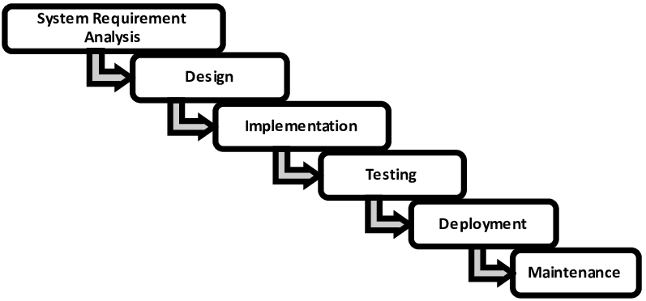

# Ingeniería de Software

## Software

### Definición clásica

Se trata de una secuencia de intrucciónes que dada una entrada dan una salida determinada

### Definición cátedra

Modelo computable de un problema de un recorte de la realidad.

Uno de los factores más importantes es la extensibilidad, es decir, la capacidad de poder agregar nuevas funcionalidades sin tener que modificar el código existente.

## Buen modelo de la realidad

Un buen modelo de la realidad consta de 3 ejes principales

### Eje funcional

Trata de representar 1 a 1 los entes de la realidad con la abstracción de objetos. Además si algo nuevo aparece en la realidad, algo nuevo debe aparecer en la representación.

### Eje descriptivo

El código debe ser claro y entendible por cualquier persona que lo lea, además de ser fácil de mantener. Debe ser descripitvo usando buenos nombres y terminlogía del negocio / dominio.

### Eje implementativo

Es la parte más detallista del código, es decir, cómo se implementa el código. Habla del funcionamineto de la maquina y de la performance.

En nuestro caso, el eje menos importante.

## Características escenciales del software

### Complejidad

Es la construcción de gran tamaño sin 2 partes iguales. La complejidad es inherente a la realidad, pero la complejidad accidental es la que se agrega por no saber modelar la realidad.

### Conformidad

Se modela algo arbirtario, definido por el usuario.

### Variabilida

Se espera que se adapte al cambio.

### Invisibilidad

Estamos construyendo algo que no se puede ver ni tocar.

## Complejidad del software

### Complejidad inherente

Es la complejidad que se deriva de la realidad, es decir, la complejidad que ya existe en la realidad. Crece exponencialmente a medida que añadamos actores.

### Complejidad accidental

Todo lo que surge por transladar un problema real a una maquina. No es inherente al problema en sí, sino a razones más bien técnicas.

## Qué es la ingeniería de software

### Definición pro IEEE

La aplicación de un enfoque sistemático, disciplinado y cuantificable al desarrollo, operación y mantenimiento del software.

### Waterfall (Royce '70)

Según Royce, el modelo de desarrollo de software en cascada es un enfoque lineal y secuencial para el desarrollo de software que se basa en una visión de la gestión de proyectos que se divide en una serie de fases distintas. Cada fase debe completarse antes de pasar a la siguiente.

Por otro lado, Royce más adelante admitió que el modelo de cascada no era adecuado para el desarrollo de software, ya que no permitía la retroalimentación y la iteración, por ende era muy dificil llevarlo a la realidad.

### Manifesto for Agile Software Development

- Individuos e interacciones sobre procesos y herramientas
- Software funcionando sobre documentación extensiva
- Colaboración con el cliente sobre negociación de contratos (siempre es bueno hacer un contrato a corto plazo ya que es más realista y sincero para ambas partes)
- Respuesta ante el cambio sobre seguir un plan

### Extreme Programming (XP)

Habla de estar constantemente haciendo ciclos de desarorllo e iterando sobre nuestros pasos para mejorar el producto.

